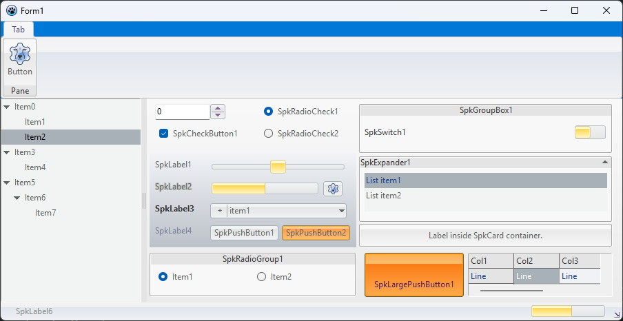



## SpkCtrls Package

The SpkCtrls is a controls package for lazarus(LCL) using a third party **SpkToolbar** units to render identical controls for use outside the ribbon menu.
Some controls are originals but with the same looklike and Behaviours.

Check out the third party software **necessary** for this pack at: [SpkToolbar repository](https://sourceforge.net/projects/lazarus-ccr/files/SpkToolbar/).

## 📦 Install
- The SpkCtrls is a package for Lazarus IDE, released as lpk format.
- Its ready to use but require the `SpkToolbar` package, then install it first. 
- This package install all components for a new pallete `SpkControls`.

## ⚙️ Usage
- On main form must insert the TSpkToolbar first, set scheme colors or a custom colors then put the `TSpkBackground` control.
- Inside `TSpkBackground` or `TSpkPanel` goes any other Spk\* controls, but first set the `SpkToolbar` property linking the SpkToolbar.
- The background/panel control is used as workspace of form or dialog then any SpkCtrl inside must auto referer the `SpkToolbar`.
- Design the form as usual using the SpkCtrls equivalent, mixing with any LCL Control.

## Details
- Each control of SpkCtrl has a `SpkToolbar` property to link TSpkToolbar(third party) for use its colors and metrics.
- A Redraw() method is available to force a redraw, since its controls are rendered using an extended cycle of LCL paint.
- The controls are very simple with few options and properties.
- Some controls are limited in 22 pixels for height and auto sized, like buttons(according caption).
- All design project is according with the SpkToolbar features and result in a cohesive themed controls.

## Container controls
We use a well defined controls to embbed complex controls. Some LCL controls are able to be modified with custom colors, for this kind of control we use a container to receive the control and auto set the colors at design-time. The controls that has \*Container must receive the control indicated by the prefix, like `TSpkTreeViewContainer` for TTreeview. To use that just put inside container at design-time and change all properties of interest.

## Options
There are some options for the controls. Any option or control variables are located at the file `SpkOptions.inc`. Remember to recompile the entire package if you change any variable or constant.

## ⌨️ Copyright notice
© 2025 Humberto Teófilo, All Rights Reserved.   

## ☀️ License
This software is released under Modified LGPL (with linking exception, same of LCL). This is a free software, inclusive for comercial use and modifications under the license terms. See the file “license.txt”.
